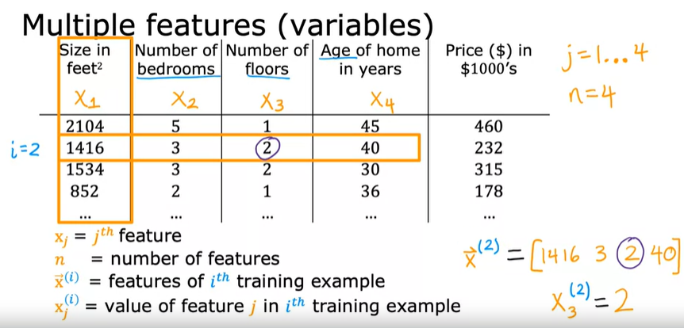
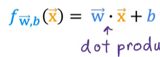

# Multiple Features Notes

Currently we have `f_wb = m*x + b` which works on a single feature (x as input).

If we increase the number of input data, we refer to that as multiple features.

Remember, a training set is the data a supervised algorithm uses and the features of that training set is the input data. The target is the provided output data that the algorithm must match. We use gradient descent, and finding the local minima for the function of `Jw` where when `J` is at its minima, we can use it as a value to find the `w, b` for the training set.

We refer to `x` now in terms of a row vector, so that it is represented by multiple scalars. We use `i` and `j` to refer to specific parts, `j` denotes that row of `x` we are referring to, and `i` refers to the specific element within that row.

Now we have to rewrite the previous model to take into account the multiple features.

For example, based on the image above, we can rewrite the original model:

### Previous Model
`f_wb(x) = w*x + b`

### New Model
`f_wb(x) = w1*x1 + w2*x2 + w3*x3 + w4*x4 + b`

This could then be substituted with values, for example:

`f_wb(x) = 0.1*x1 + 4*x2 + 10*x3 + -2*x4 + 80`

Where:
- `x1 = size`
    - The size scales by a size of 100, assuming that the price of houses is in 1000s of dollars.
- `x2 = #bedrooms`
    - The number of bedrooms scales by a size of 4000
- `x3 = #floors`
    - The number of floors scales by a size of 10000
- `x4 = years`
    - The age of the house leads to a scale size of -2000

### Model with `n` features
`f_wb(x) = w1*x1 + w2*x2 + ... + wn*xn + b`

We can rewrite `w` as a row vector containing the the values that is used.
- `w = [w1 w2 w3 ... wn]`
We then write `b` as a number.
- `b` is a number
These two represent the parameters of the model.

We can then rewrite `x` as a row vector as well.
- `x = [x1 x2 x3 ... xn]`

This simplifies the equation to this

This is referred to as 'Multiple Linear Regression'.